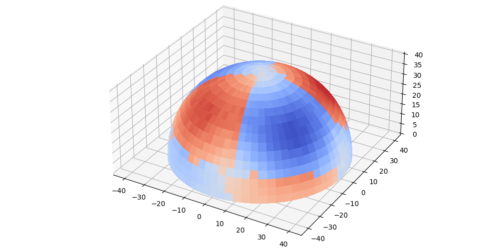

# MagneticReadoutProcessing



MagneticReadoutProcessing is a Python library that makes it possible to store and further process raw data from magnetometers. The focus is on the processing of point clouds, on which the points are located on a circular path around a magnetic object to be viewed. Measurement data (hemisphere) can later be combined into a full 3D scan, visualized and compared with reference measurements.

## PyPi

[pypi-MagneticReadoutProcessing](https://pypi.org/project/MagneticReadoutProcessing/)

## ReadTheDocs

[magneticreadoutprocessing.readthedocs.io](https://magneticreadoutprocessing.readthedocs.io/en/latest/)

## OpenSourceImaging

[opensourceimaging](https://www.opensourceimaging.org/project/magneticreadoutprocessing/)

## PAPER / THESIS

### ABTRACT

A large number of permanent magnets are used in the construction of low-field MRI equipment on the basis of permanent magnets.
The magnetic properties of these magnets must be similar to a certain degree in order to achieve a homogeneous B0 field, which is necessary for many setups. Due to the complex manufacturing process of neodymium magnets, the different properties, i.e. the direction of magnetisation, can deviate from each other.
This affects the homogeneity of the field and the image acquisition. A passive shimming process is typically used to adjust the B0 field afterwards. This is complex and time-consuming and requires manual corrections to the magnets used. To avoid this process, magnets can be systematically measured in advance. Data acquisition, storage and subsequent analysis of the recorded data play an important role in this method. It is also essential that the sensors used are repeatable and work with the specified accuracy, which must also be characterised in advance for this purpose. Several existing open source solutions implement individual parts, but do not provide a complete data processing pipeline from acquisition to analysis, and their data storage formats are not compatible with each other. For this use case, the python based MagneticReadoutProcessing library has been created in this work.
It implements all important aspects of acquisition, storage and analysis, and each intermediate step can be customised by the user without having to create everything from scratch, thus encouraging exchange between different user groups. Complete documentation, tutorials and tests enable users to use and adapt the framework as quickly as possible.
The framework was used to characterise different magnets, which requires integrating magnetic field sensors.
To evaluate the software framework and hardware, two digital sensors were characterised and tested under the same conditions for noise, temperature dependence and linearity. The result is that both sensors can only be used under certain conditions, as the noise intensity is higher than the specified 50 uT and the value ranges fluctuate too much as a result. It is recommended to consider the implementation of additional digital sensors as well as analogue sensors or NMR probes in the future.


### CITE

```
@article{OM24,
shorthand = {OM24},
shortauthor={OM},
author = {OCHSENDORF, Marcel},
license = {GPL-2.0},
month = {2},
title = {Development of a permanent magnet characterization framework for use in low-field MRI systems},
url = {https://github.com/LFB-MRI/MagneticReadoutProcessing},
version = {1.0.0},
year = {2024},
pages = {102},
doi = {10.13140/RG.2.2.36430.64325},
language = {en}
}
```
