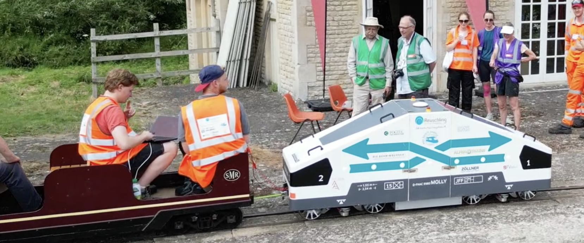
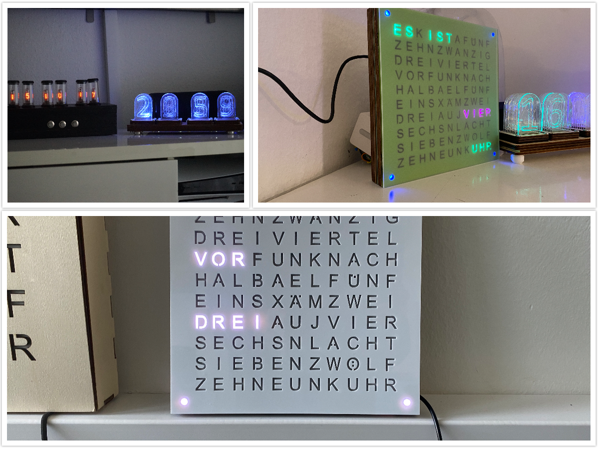
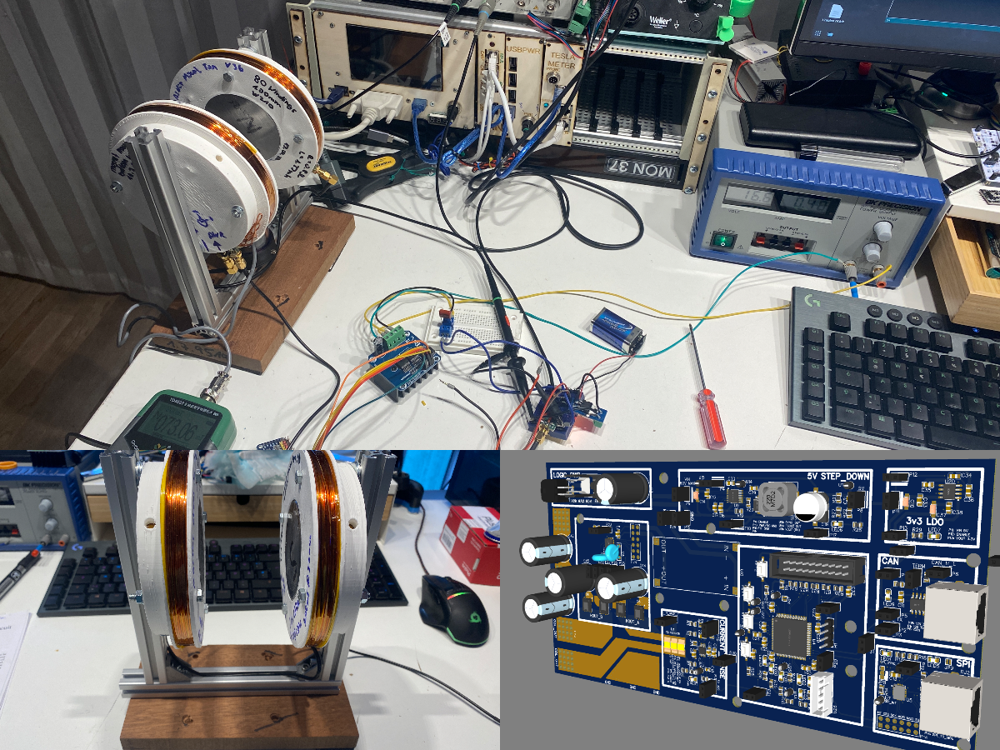
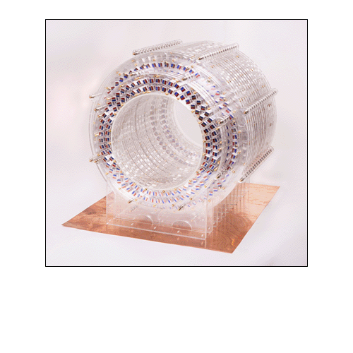
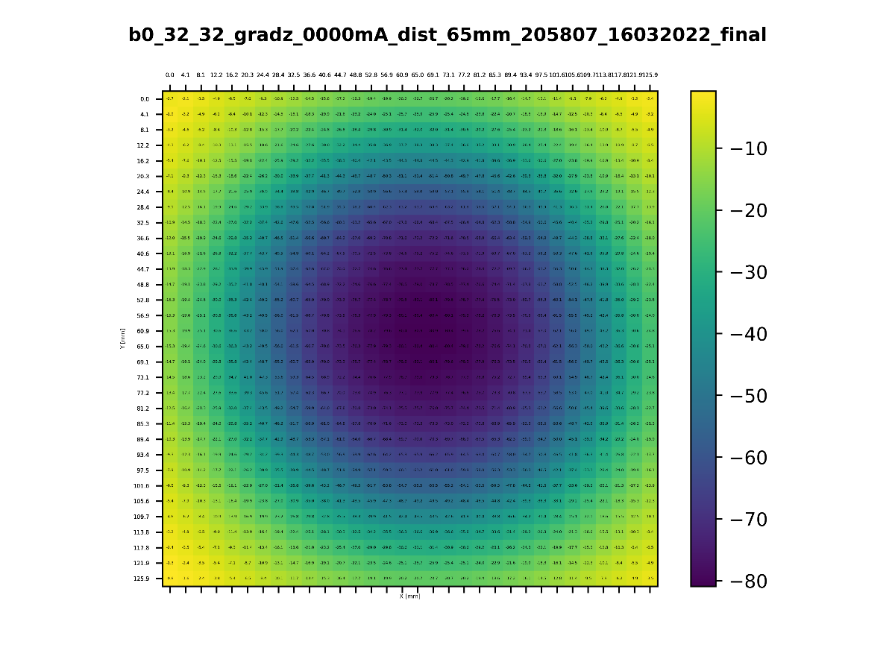
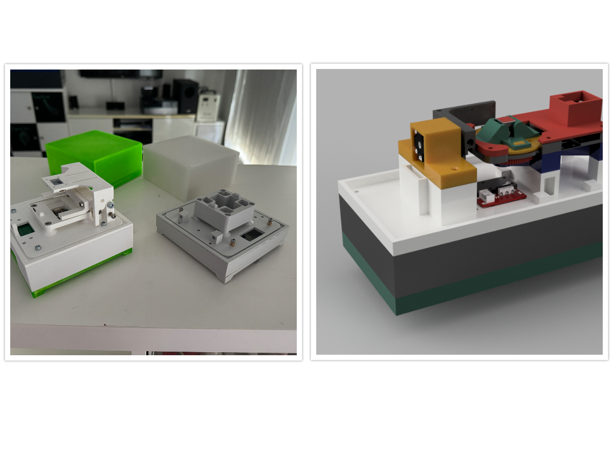
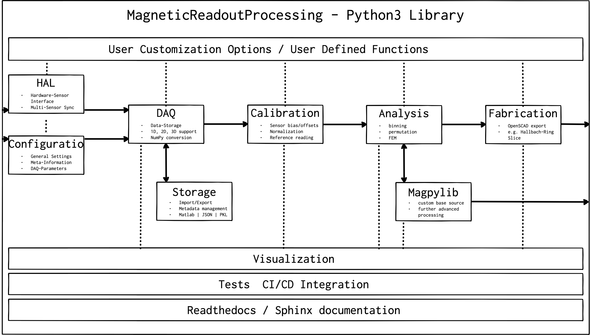
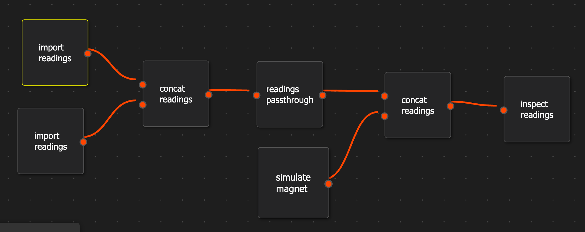
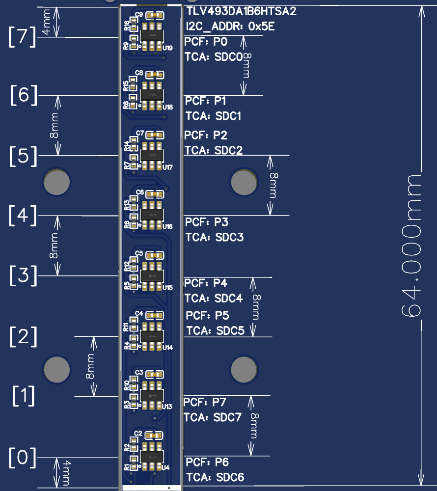

# A short introduction into the MagneticReadoutProcessing ecosystem

---

# About the author

---
## Hi, I´m Marcel

* Computer Science B.Sc.
* Information Systems Engineering M.Eng

---
## I like to build stuff

---

## and Clocks

---

## Let´s build an Low-Field MRI 

Using exising OpenSource projects

* [open-source-mri-scanner](https://www.opensourceimaging.org/2023/01/09/first-open-source-mri-scanner-presented-the-osii-one/)

* [OCRA](https://openmri.github.io/ocra/)

* [TableTopMRI](https://www.opensourceimaging.org/project/instructional-tabletop-mri-scanner/)

---

---

# Problem: We need a magnet

* 20cm bore
* homogeneity around 1000ppm
* easy to manufacture parts

---

Due to the complex manufacturing process, permanent magnets are not identical in their:

* field strength
* magnetisation direction

---

---

## Shimming

Improving homogeneity through shimming:

* complex and time intensive task

---

## Idea: Chracterise the magnets beforehand

* Measure key parameters (field strength, magnetisation direction, temperature behavior)
* Sort and generate a improved magnet design out of the collected data. 

---

# Exising research examples

---

### Optimisation algorithms

* [HalbachOptimisation](https://github.com/LUMC-LowFieldMRI/HalbachOptimisation)
* [Practical Concepts for Design, Construction and Application of Halbach Magnets in Magnetic Resonance](https://link.springer.com/article/10.1007/s00723-023-01602-2)

---

### CAD Model design script

* [HalbachMRIDesigner](https://github.com/menkueclab/HalbachMRIDesigner)
* [Variable single-axis magnetic-field generator using permanent magnets](https://www.semanticscholar.org/paper/Variable-single-axis-magnetic-field-generator-using-Tretiak-Blümler/b82f37c32d0e06dd4482d027adeae61c1ce54732)

---

## Issues

* solutions are not built on top of each other
* difficult to use the results among each other

---

# Solution

## MagneticReadoutProcessing framework

* OpenSource software and hadware
* Provides complete data processing pipeline form DAQ to CAD
* Easy modifcation of processings steps without rewriting everything

---

## Hardware framework

* 1D - 3D mapping
* Inexpensive sensors
* Interchangeable 3D printed mounts for different permanent magnet types

---

[3D mapping example](https://youtu.be/Lp4kPV_stg4)

---
## Software framework

* Python3 based with type annotiations
* Interchangeable dataformats (JSON, Matlab, Numpy)
* Fully tested using pytest
* Online documentation
* No programming skills required

---

## Processing pipeline

---

## CLI and programmable processing pipeline

* Userfriendly CLI to conigure measurements
* Drag&Drop processing pipeline

---

# DEMO TIME

---

# Outlook

* further evaluation needed
* Hardware accuracy measurements for all sensors needed

---

# Questions ?

---

# Backup

---

* cheap magnetic field camera development

---