# Introduction

## Background and Motivation

### Low-Field MRI

### Shimming procedure

## Aim of this Thesis


## Structure


# State of the art

## Opensource projects

## Conceptual design

* etnwicklung eines hardware uns software framework zur einfachen aquirierung von Meagnetfelddaten
* analysetools und funktionen


# Usecases


# Unified Sensor


* ziel ist es einen low cost hallsensor-interface  zu entwickeln welcher möglichst
* universell
* verschienee sensoren abbilden kann
* mit verschienden magneten typen und formen nutzbar
* reproduzierbar
* 1d, 2d, 3d
* integration

## Sensor selection

: Implemented digital halleffect sensors \label{Implemented_digital_halleffect_sensors.csv}

|                    | TLV493D-A1B6 | HMC5883L | MMC5603NJ | AS5510 |
| ------------------ | ------------ | -------- | --------- | ------ |
| Readout-Axis       | 3D           | 3D       | 3D        | 1D     |
| Temperature-Sensor | yes          | no       | yes       | no     |
| Resolution [uT]    | 98           | 0.2      | 0.007     | 48     |
| Range [mT]         | ±130.0       | ±0.8     | ±3        | ±50    |
| Interface          | (+i2c)       | (+i2c)   | (+i2c)    | (+i2c) |


* for higher ranges analog sensoren nutzen welche jedoch eine aufwändigere schaltung erfodern
* datenblatte links ergänzen
* alle i2c in der regel, welches eine einfache integration  ermöglicht
* eingebauter temperatursensor ermöglicht temperaturkompensation
* conrad teslameter mit seperaten temperatursensor


## Mechanical Structure

* 3d druck toleranztest
* magnet halterung mit kraftloser arretierung
* motoren und andere unter umstaänden magnetische teile in der nähe des sensors
* nylon schrauben, 3d druck, 3d gedruckte klemmverbindungen
* später rausrechnen durch kalibierung

## Electrical Interface

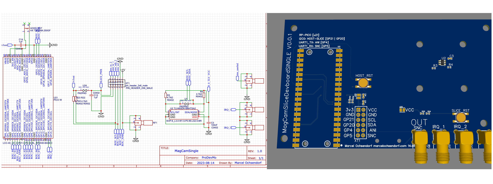


\ref{1D_sensor_schematic_and_circuit_board.png} 


* usb
* multiplexer for i2c sensors alredy implemented
* imput / output for sync


## Firmware

Microcontroller firmware is software that is executed on a microcontroller in embedded systems. It controls the hardware and enables the execution of predefined functions. The firmware is used to process input data, control output devices and fulfil specific tasks according to the program code. It handles communication with sensors, actuators and other peripheral devices, processing data and making decisions. Firmware is critical to the functioning of devices.

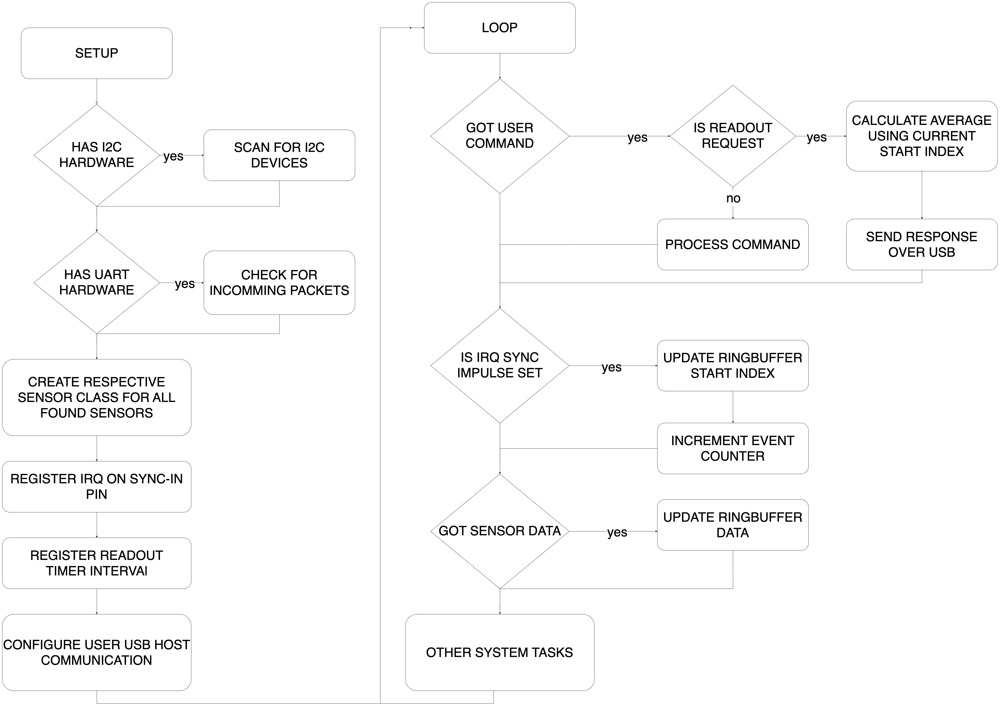


The firmware is responsible for detecting the possible connected sensors\ref{Implemented_digital_halleffect_sensors.csv} and reading them out. This measured data can be forwarded to a host (+pc) via a user interface and can then be further processed there.
An important component is that as many common sensors as possible can be easily connected without having to adapt the firmware. This modularity was implemented using `abstract` class design. These are initiated according to the sensors found at startup. If new hardware is to be integrated, only the required functions\ref{lst:CustomSensorClass} need to be implemented.

```cpp {#lst:CustomSensorClass caption="CustomSensor-Class for adding new sensor hardware support"}
#ifndef __CustomSensor_h__
#define __CustomSensor_h__
// register your custom sensor in implemented_sensors.h also
class CustomSensor: public baseSensor
{
public:
    CustomSensor();
    ~CustomSensor();
    // implement depending sensor communication interface
    bool begin(TwoWire& _wire_instance); // I2C
    bool begin(HardwareSerial& _serial_instance); // UART
    bool begin(Pin& _pin_instance); // ANALOG or DIGITAL PIN like onewire
    // FUNCTIONS USED BY READOUT LOGIC
    bool is_valid() override;
    String capabilities() override;
    String get_sensor_name() override;
    bool query_sensor() override;
    sensor_result get_result() override;        
};
#endif
```

The flow chart\ref{Unified_sensor_firmware_simplified_program_strucutre.png} shows the start process and the subsequent main loop for processing the user commands and sensor results.
When the microcontroller is started, the software checks whether known sensors are connected to (+i2c) or (+uart) interfaces.
If any are found (using a dedicated (+lut) with sensor address information), the appropriate class instances  are created and these can later be used to read out measurement results.

Next, the subsystem for multi-sensor synchronisation\ref{sensor-syncronsisation-interface} is set up. The last step in the setup is to set up communication with the host or connected (+pc).
All microcontroller platforms used here have a (+usb) slave port. The used usb descriptor is `Serial over (+usb)`- ((+usb)(+cdc)). This is used to emulate a virtual RS232 communication port using a USB port on a (+pc) and usually no additional driver is needed on modern systems.

Now that the setup process is complete, the system switches to an infinite loop, which processes several possible actions. One task is, to react to user commands which can be sent to the system by the user via the integrated (+cli).
All sensors are read out via a timer interval set in the setup procedure and their values are stored in a ringbuffer.
Ring buffers, offer efficient data management in limited memory. Its cyclic structure enables continuous overwriting of older data, saves memory space and facilitates seamless processing of real-time data. Ring buffers are well suited for applications with variable data rates and minimise the need for complex memory management.
The buffer can be read out by command and the result of the measurement is sent to the host.
Each sensor measurement result is transmitted from the buffer to the host together with a time stamp and a sequential number. This ensures that in a multi-sensor setup with several sensors. The measurements are synchronized\ref{sensor-syncronsisation-interface} in time and are not out of sequence or drift.


### Communication interface

.png)


Each sensor that has been loaded with the firmware, registeres on to the host (+pc) as a serial interface. There are several ways for the user to interact with this:

* Use with (+mrp)-library\ref{software-readout-framework}
* Stand-alone mode via sending commands using built-in (+cli)

The (+cli) mode is a simple text-based interface with which it is possible to read out current measured values, obtain debug information and set operating parameters. This allows you to quickly determine whether the hardware is working properly after installation.
The (+cli) behaves like terminal programmes, displaying a detailed command reference\ref{Sensors_(+cli).png} to the user after connecting. The current measured value can be output using the `readout` command\ref{Query_sensors_b_value_using_(+cli).png}. 

.png)


The other option is to use the (+mrp)-library. The serial interface is also used here. However, after a connection attempt by the `MRPHal` module\ref{hal} of the (+mrp)-library, the system switches to binary mode, which is initiated using the `sbm` command. However, the same commands are available as for (+cli)-based communication.


### Sensor syncronsisation interface

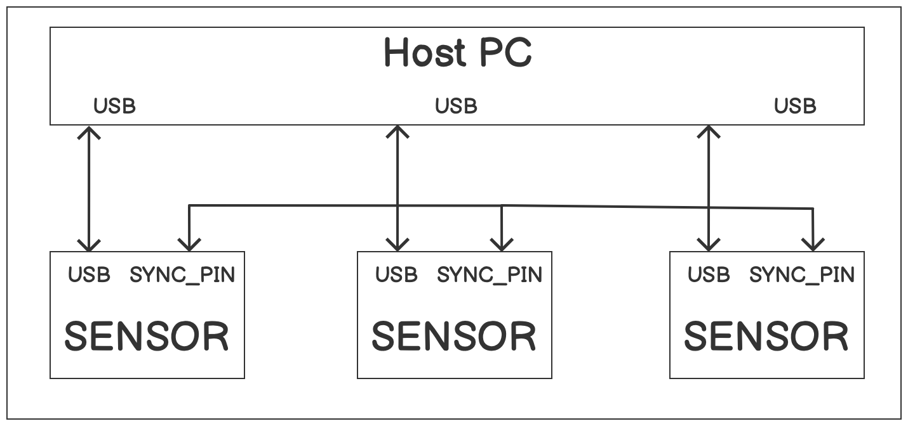


One problem with the use of several sensors on one readout host (+pc) is that the measurements may drift over time. On the one hand, (+usb) latencies can occur. This can occur due to various factors, including device drivers, data transfer speed and system resources. High-quality (+usb) devices and modern drivers often minimise latencies. Nevertheless, complex data processing tasks and overloaded (+usb) ports can lead to delays.

The other issue is sending the trigger signal from the readout software\ref{software-readout-framework}. Here too, unpredictable latencies can occur, depending on which other tasks are also executed on this port.

In order to enable the most stable possible synchronisation between several sensors, an option has already been created to establish an electrical connection between sensors. This is used together with the firmware to synchronise the readout intervals. The schematic\ref{Multi_sensor_synchronisation_wiring_example.png} shows how several sensors must be wired together in order to implement this form of synchronisation.


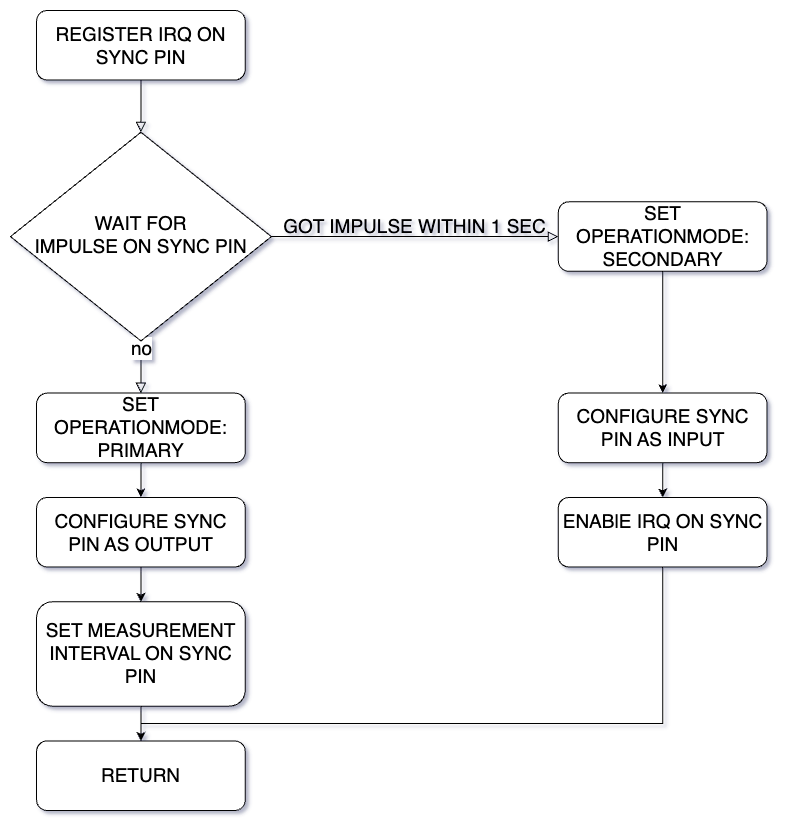


Once the hardware has been prepared, the task of the firmware of the various sensors is to find a common synchronisation clock. To do this, the `register irq on sync pin` is overwritten. To set one `primary` and several `secondary` sensors, each sensor waits for an intial pulse on the sync-pin\ref{Unified_sensor_firmware_multi_sensor_synchronisation_procedure.png}. Each sensor starts a random timer beforehand, which sends a pulse on the sync line. All others receive this and switch to `secondary` mode and synchronise the measurements based on each sync pulse received.
Since the presumed `primary` sensor cannot register its own sync pulse (because the pin is switched to output), there is a timeout `got pulse within 1000ms` and this becomes the `primary` sensor.
This means that in a chain of sensors there is exactly one `primary` and many `secondary` sensors.
In single-sensor operation, this automatically jumps to `primary` sensor operation through the `got impulse within 1000ms` query.
The synchronisation status can be queried via the user interface\ref{communication-interface} using the `opmode`\ref{Query_opmode_using_(+cli).png} command.
An important aspect of the implementation here was that there is no numbering or sequence of the individual sensors. This means that for the subsequent readout of the measurements, it is only important that they are taken at the same interval across all sensors. The sensor differentiation takes place later in the readout software\ref{software-readout-framework} by using the sensor identification number.

.png)


## Example sensors

Two functional sensor platforms\ref{Build_sensors_with_different_capabilities.csv} were built in order to create a solid test platform for later tests and for the development of the (+mrp) library with the previously developed sensor concepts.

: Build sensors with different capabilities \label{Build_sensors_with_different_capabilities.csv}

|                     | 1D\ref{d-single-sensor} | 1D: dual sensor   | 3D: Fullsphere\ref{d-fullsphere} |
| ------------------- | ----------------------- | ----------------- | -------------------------------- |
| Maximal magnet size | Cubic 30x30x30          | Cubic 30x30x30    | Cubic 20x20x20                   |
| Sensor type         | MMC5603NJ               | TLV493D           | TLV493D                          |
| Sensor count        | 1                       | 2                 | 1                                |
| Scanmode            | static (1 point)        | static (2 points) | dynamic (fullsphere)             |

These cover all the required functions described in the Usecases\ref{usecases}. The most important difference, apart from the sensor used, is the `scan mode`. In this context, this describes whether the sensor can measure a `static` fixed point on the magnet or if the sensor can move  `dynamically` around the magnet using a controllable manipulator.

In the following, the hardware structure of a `static` and `dynamic` sensor is described. For the `static` sensor, only the `1D` variant is shown, as this does not differ significantly from the structure of the `1D: dual sensor`, except it uses two `TLV493D` sensors, mounted above and on top of the magnet.


### 1D: Single Sensor


The `1D` sensor\ref{1D_sensor_construction_with_universal_magnet_mount.png} is the simplest possible sensor that is compatible with the `Unified Sensor Firmware`\ref{firmware} platform and also with the (+mrp)-library\ref{software-readout-framework}.

The electrical level here is based on a `Raspberry-Pi Pico` together with the `MMC5603NJ` magnetic sensor.
The mechanical setup consists of four 3D-printed components, which are fixed together with nylon screws to minimise possible influences on the measurement.

Since the `MMC5603NJ` only has very limited measuring range, even small neodymium magnets already saturate this range, it is possible to use 3D-printed spacers above the sensor.

The standard magnet holder can be adapted for different magnet shapes and can be placed on the spacer without play in order to be able to perform a repeatable measurement without introducing measurement irregularities by mechanically changing the magnet.


### 3D: Fullsphere


The `3D Fullsphere`\ref{Full-Sphere_sensor_implementation_using_two_Nema17_stepper_motors_in_a_polar_coordinate_system.png} sensor offers the possibility to create a 3D map\ref{3D_plot_of_an_N45_12x12x12_magnet_using_the_3D_fullsphere_sensor.png} of the magnets.
The magnet sensor is mounted on a movable arm, which can move 180 degrees around the magnet on one axis. In order to be able to map the full sphere, the magnet is mounted on a turntable. This permits the manipulator to move a polar coordinate system.


As the magnets in the motors, as with the screws used in the 1D sensor, can influence the measurements of the magnetic field sensor, the distance between these components and the sensor or magnets was increased. The turntable and its drive motor are connected to each other via a belt.

On the electrical side, it also consists of a `SKR Pico` stepper motor controller, together with the `TLV493D` magnetic field sensor. This was chosen because of its larger measuring range and can therefore be used more universally without having to change the sensor of the arm.

### Integration of an industry teslameter

As the sensors shown so far relate exclusively to self-built, low-cost hardware, the following section shows how existing hardware can be integrated into the system. This is shown here using a temperature-compensated `Voltcraft GM-70` telsameter\ref{Voltcraft_GM70_teslameter_with_custom_(+pc)_interface_board.png}, which has a measuring range of `0-3T` with a resolution of 0.1mT. This offers an `RS232` interface with a documented protocol\ref{Voltcraft_GM70_serial_protocol.csv} for connection to a (+pc). 
This connectivity makes it possible to make the device compatible with the (+mrp) library using interface software [@VoltcraftGM70Rest] executable on the host (+pc). However, it does not offer the range of functions that the `Unified Sensor Firmware`\ref{firmware} offers.

_interface_board.png)


Another option is a custom interface board between the meter and the PC. This is a good option as many modern (+pc)s or (+sbc)s no longer offer an `RS232` interface. As with the other sensors, this interface consists of your `RaspberryPi Pico` with an additional level shifter. The Teslameter is connected to the microcontroller using two free (+gpio)s in (+uart) mode. The `Unified Sensor Firmware`\ref{firmware} was adapted using a separate build configuration and the protocol of the measuring device was implemented.

: Voltcraft GM70 serial protocol \label{Voltcraft_GM70_serial_protocol.csv}

| BYTE-INDEX | REPRESENTATION |  VALUE                   |
| ---------- | -------------- | ------------------------ |
| 0          | PREAMBLE       | 0x2                      |
| 1          |                | 0x1                      |
| 2          |                | 0x4                      |
| 3          | UNIT           | 'B' => Gauss 'E' => mT   |
| 5          | POLARITY       | '1' => *0.1 '2' => *0.01 |
| 6          | value MSB      | 0x-0xFF                  |
| 13         | value LSB      | 0x-0xFF                  |
| 14         | STOP           | 0x3                      |

This software or hardware integration can be carried out on any other measuring device with a suitable communication interface and a known protocol thanks to the modular design.


# Software readout framework


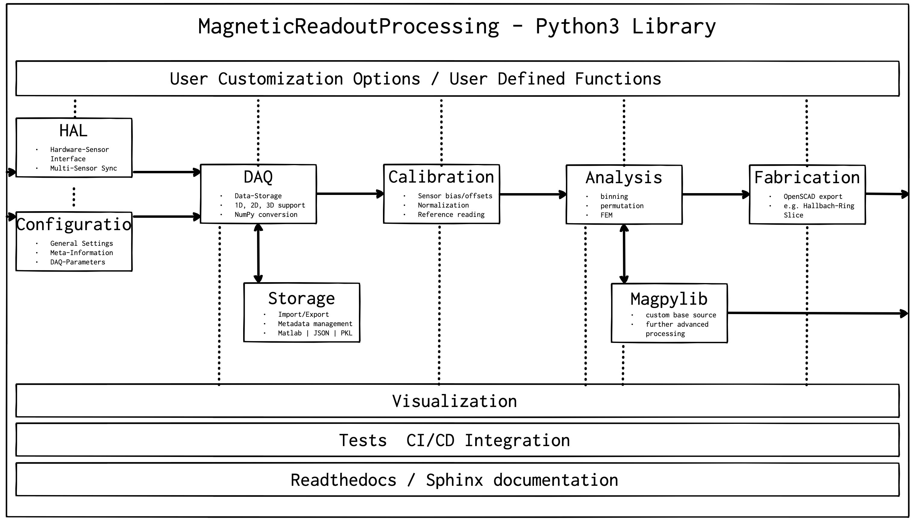


## Library requirements


### Concepts

* beispiele für projekte welche nur einzelne schnritte implementieren
* so kann man sich auf die implementierung 

### User interaction points


* grafik zeigen
* einzelne module erleutern

 
#### HAL

* aufbau hal im grunde wird nur ein die commandos an das sensor cli weitergegeben
* alle sensoren implementieren mehr oder weniger die gleichen befehle
* hal gibt nur weiter und ist "dumm"

#### Visualisation


### Export

* format import export
* matlab

#### Meta-Data


### Multible sensor setup

At the current state of implementation, it is only possible to detect and use sensors that are directly connected to the (+pc) with the (+mrp)-library. This has the disadvantage that there must always be a physical connection. This can make it difficult to install multiple sensors in measurement setups where space or cable routing options are limited. To make sensors connected to a small `remote` (+pc) available on the network, the `Proxy`\ref{MRPlib_Proxy_Module.png} module has been developed. This can be a (+sbc) (e.g. a Raspberry Pi). The small footprint and low power consumption make it a good choice. It can also be used in a temperature chamber. The approach of implementing this via a (+rest) interface also offers the advantage that several measurements or experiments can be recorded at the same time with the sensors.

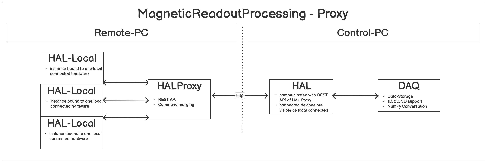


Another application example is when sensors are physically separated or there are long distances between them.
By connecting several sensors via the proxy module, it is possible to link several instances and all sensors available in the network are available to the control (+pc).

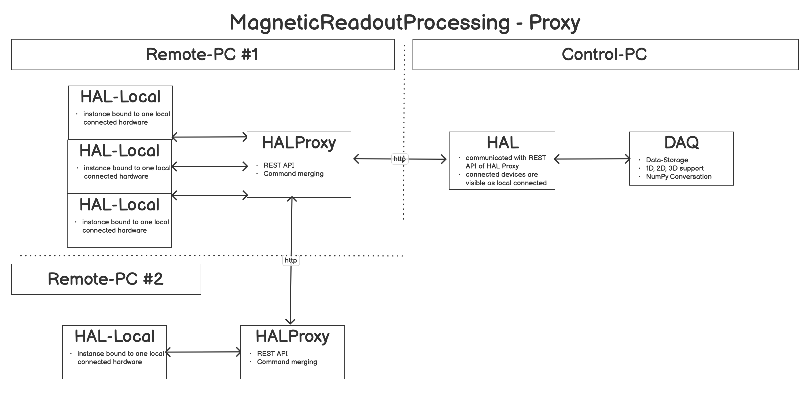


The figure \ref{mrp_proxy_multi.png} shows the modified `multi-proxy - multi-sensor` topology. Here, both proxy instances do not communicate directly with the control (+pc), but `remote (+pc) #2` is connected to `remote (+pc) #1`. This is then visible as a sensor opposite the Control (+pc), even if there are several proxy instances behind it.


#### Network-Proxy

The figure \ref{MRPlib_Proxy_Module.png} shows the separation of the various (+hal) instances, which communicate with the physically connected sensors on the `remote`-(+pc) and the `control`-(+pc) side, which communicates with the remote side via the network. 
For the user, nothing changes in the procedure for setting up a measurement. The proxy application must always be started\ref{lst:mrpcli_proxy_start} on the `remote` (+pc) side.


```bash {#lst:mrpcli_proxy_start caption="MRPproxy usage to enable local sensor usage over network"}
# START PROXY INSTNACE WITH TWO LOCALLY CONNECTED SENSORS
$ python3 mrpproxy.py proxy launch /dev/ttySENSOR_A /dev/ttySENSOR_B # add another proxy instance http://proxyinstance_2.local for multi-sensor, multi-proxy chain
Proxy started. http://remotepc.local:5556/
PRECHECK: SENSOR_HAL: 1337 # SENSOR A FOUND
PRECHECK: SENSOR_HAL: 4242 # SENSOR B FOUND
Terminate  Proxy instance [y/N] [n]: 
```

After the proxy instance has been successfully started, it is optionally possible to check the status via the (+rest) interface:\ref{lst:mrpcli_config_rest}

```bash {#lst:mrpcli_config_rest caption="MRPproxy REST enpoiint query examples"}
    # GET PROXY STATUS
    $ wget http://proxyinstance.local:5556/proxy/status
    {
    "capabilities":[
      "static",
      "axis_b",
      "axis_x",
      "axis_y",
      "axis_z",
      "axis_temp",
      "axis_stimestamp"
   ],
   "commands":[
      "status",
      "initialize",
      "disconnect",
      "combinedsensorcnt",
      "sensorcnt",
      "readsensor",
      "temp"
   ]

   # RUN A SENSOR COMMAND AND GET THE TOTAL SENSOR COUNT
   $ wget http://proxyinstance.local:5556/proxy/command?cmd=combinedsensorcnt
   {
   "output":[
      "2"
   ]
}
}
```

The query result shows that the sensors are connected correctly and that their capabilites have also been recognised correctly. To be able to configure a measurement on the other, only the (+ip) address or host name of the remote (+pc) is required\ref{lst:mrpcli_config_using_rpc}. 


```bash {#lst:mrpcli_config_using_rpc caption="MRPcli usage example to connect with a network sensor"}
# CONFIGURE MEASUREMENT JOB USING A PROXY INSTANCE
$ MRPcli config setupsensor testcfg --path http://proxyinstance.local:5556
> remote sensor connected: True using proxy connection:
> http://proxyinstance.local:5556 with 1 local sensor connected
```


#### Sensor Syncronisation

Another important aspect when using several sensors via the proxy system is the synchronisation of the measurement intervals between the sensors. 
Individual sensor setups do not require any additional synchronisation information, as this is communicated via the (+usb) interface.
If several sensors are connected locally, they can be connected to each other via their sync input using short cables. One sensor acts as the central clock as described in\ref{sensor-syncronsisationiinterface}.
this no longer works for long distances and the syncronisation must be made via the network connection. 

If time-critical synchronisation is required, (+ptp) and (+pps) output functionality can be used on many (+sbc), such as the `Raspberry-Pi Compute Module 4`.


* was ptp, bild pps output
* alle clients über ptp verbunden
* dso bild von jeff gerling über rpi4 ptp


#### Command-Router

* nummerieierung zuerst lokale sensoren dann weitere proxy sensoren
* commando templating
* einzelne sensor capabilites werden gemerged
* ids werden aufsuimmiert
* spätere sensor identifikation geschieht über die jeweilige sensor id, welche über diesen index abgefragt werden kann

* tablle mit mergin algorithmus


### Examples


# Usability improvements

Usability improvements in software libraries are crucial for efficient and user-friendly development. Intuitive API documentation, clearly structured code examples and improved error messages promote a smooth developer experience. Standardised naming conventions and well thought-out default values simplify the application. A (+gui) or (+cli) application for complex libraries can make it easier to use, especially for developers with less experience. Continuous feedback through automated tests and comprehensive error logs enable faster bug fixing. The integration of community feedback and regular updates promotes the adaptability of the (+mrp)-library to changing needs. Effective usability improvements help to speed up development processes and increase the satisfaction of the developer community.
In the following, some of these have been added in and around the (+mrp)-library, but they are only optional components for the intended use.

## Command Line Interface

_output_to_configure_a_new_measurement.png)


In the first version of this (+mrp)-library, the user had to write his own Python scripts even for short measurement and visualisation tasks. However, this was already time-consuming for reading out a sensor and configuring the measurement parameters and metadata and quickly required more than 100 lines of new Python code. Although such examples are provided in the documentation, it must be possible for programming beginners in particular to use them. To simplify these tasks, a (+cli)\ref{example_measurement_analysis_pipeline.png} was implemented around this (+mrp)-library. The (+mrp)-library-(+cli) implements the following functionalities:

* Detection of connected sensors
* Configuration of measurement series
* Recording of measured values from stored measurement series
* Simple commands for checking recorded measurement series and their data.

Thanks to this functionality of the (+cli), it is now possible to connect a sensor to the (+pc), configure a measurement series with it and run it at the end. The result is then an exported file with the measured values.
These can then be read in again with the (+mrp)-library and processed further. The following bash code\ref{lst:mrpcli_config_run} shows the setup procedure in detail:

```bash {#lst:mrpcli_config_run caption="CLI example for configuring a measurement run"}
# CLI EXAMPLE FOR CONFIGURING A MEASUREMENT RUN
## CONFIGURE THE SENSOR TO USE
$ MRPcli config setupsensor testcfg
> 0 - Unified Sensor 386731533439 - /dev/cu.usbmodem3867315334391
> Please select one of the found sensors [0]:
> sensor connected: True 1243455
## CONFIGURE THE MEASUREMENT
$ MRPcli config setup testcfg
> CONFIGURE testcfg
> READING-NAME: [testreading]: testreading
> OUTPUT-FOLDER [/cli/reading]: /tmp/reading_folder_path
> NUMBER DATAPOINTS: [1]: 10
> NUMBER AVERAGE READINGS PER DATAPOINT: [1]: 100
# RUN THE CONFIGURED MEASUREMENT
$ MRPcli measure run
> STARTING MEASUREMENT RUN WITH FOLLOWING CONFIGS: ['testcfg']
> config-test: OK
> sensor-connection-test: OK
> START MEASUREMENT CYCLE
> sampling 10 datapoints with 100 average readings
> SID:0 DP:0 B:47.359mT TEMP:23.56
> ....
> dump_to_file testreading_ID:525771256544952_SID:0_MAG:N45_CUBIC_12x12x12.mag.json
```

## Programmable data processing pipeline

After it is very easy for users to carry out measurements using the (+cli), the next logical step is to analyse the recorded data. This can involve one or several hundred data records. Again, the procedure for the user is to write their own evaluation scripts using the (+mrp)-library. This is particularly useful for complex analyses or custom algorithms, but not necessarily for simple standard tasks such as bias compensation or graphical plot outputs.

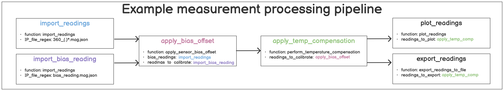


For this purpose, a further (+cli) application was created, which enables the user to create and execute complex evaluation pipelines for measurement data without programming.
The example\ref{example_measurement_analysis_pipeline.png} shows a typical measurement data analysis pipeline, which consists of the following steps:

* Import the measurements
* Determine sensor bias value from imported measurements using a reference measurement
* Apply linear temperature compensation
* Export the modified measurements
* Create a graphical plot of all measurements with standard deviation


In order to implement such a pipeline, the `yaml` file format was chosen for the definition of the pipeline, as this is easy to understand and can also be easily edited with a text editor.
Detailed examples can be found in the documentation[@MagneticReadoutProcessingReadTheDocs].
The pipeline definition consists of sections which execute the appropriate Python commands in the background. The signatures in the `yaml` file are called using `reflection` and a real-time search of the loaded `global() symbol table`[@PythonGlobalSymbolTable].
This system makes almost all Python functions available to the user. To simplify use, a pre-defined list of tested (+mrp) library functions for use in pipelines is listed in the documentation[@MagneticReadoutProcessingReadTheDocs].
 The following pipeline definition\ref{lst:mrpuddp_example_yaml} shows the previously defined steps\ref{example_measurement_analysis_pipeline.png} as `yaml` syntax.

```yaml {#lst:mrpuddp_example_yaml caption="Example User Defined Processing Pipeline"}
stage import_readings:
  function: import_readings
  parameters:
    IP_input_folder: ./readings/fullsphere/
    IP_file_regex: 360_(.)*.mag.json

stage import_bias_reading:
  function: import_readings
  parameters:
    IP_input_folder: ./readings/fullsphere/
    IP_file_regex: bias_reading.mag.json

stage apply_bias_offset:
  function: apply_sensor_bias_offset
  parameters:
    bias_readings: stage import_bias_reading # USE RESULT FROM FUNCTION import_bias_reading
    readings_to_calibrate: stage import_readings

stage apply_temp_compensation:
  function: apply_temperature_compensation
  parameters:
    readings_to_calibrate: stage import_readings # USE RESULT FROM FUNCTION import_readings

stage plot_normal_bias_offset:
  function: plot_readings
  parameters:
    readings_to_plot: stage apply_temp_compensation
    IP_export_folder: ./readings/fullsphere/plots/
    IP_plot_headline_prefix:  Sample N45 12x12x12 magnets calibrated

stage export_readings:
  function: export_readings
  parameters:
    readings_to_plot: stage apply_temp_compensation
    IP_export_folder: ./readings/fullsphere/plots/
```

Each pipeline step is divided into `stages`, which contain a name, the function to be executed and its parameters. The various steps are then linked by using the `stage <name>` as the input parameter of the next function to be executed (see comments in \ref{lst:mrpuddp_example_yaml}).
It is therefore also possible to use the results of one function in several others without them directly following each other.
The disadvantages of this system are the following:

* No circular parameter dependencies
* Complex determination of the execution sequence of the steps

To determine the order of the pipeline steps, the parser script created converts them into one problem of the graph theories. Each step represents a node in the graph and the steps referred to by the input parameter form the edges.

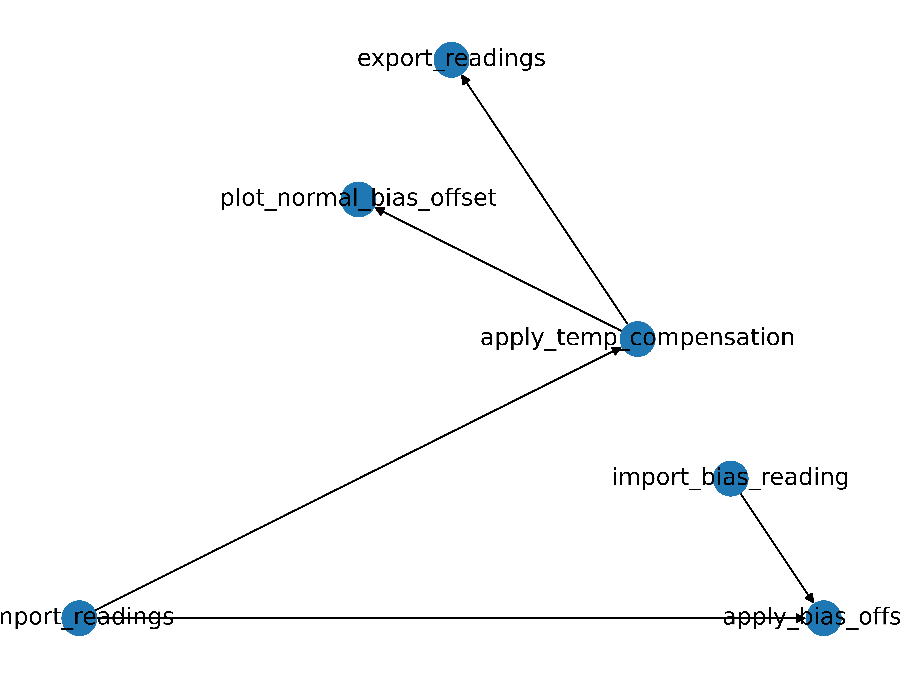


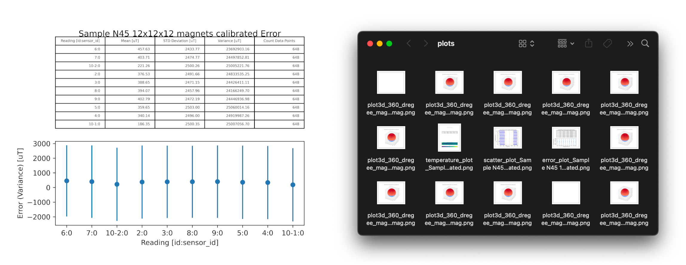


After several simplification steps, determination of possible start steps and repeated traversal, the final execution sequence can be determined in the form of a call tree\ref{Result_step_execution_tree_from_user_defined_processing_pipeline_example.png}.
The individual steps are then executed along the graph. The intermediate results and the final results\ref{pipeline_output_files_after_running_example_pipeline_on_a_set_of_readings.png} are saved for optional later use.


## Tests

Software tests in libraries offer numerous advantages for improving quality and efficiency. Firstly, they enable the identification of errors and vulnerabilities before software is published as a new version. This significantly improves the reliability of (+mrp)-library applications. Tests also ensures consistent and reliable performance, which is particularly important when libraries are used by different users and for different usecases.

.png)


During the development of the (+mrp)-library, test cases were also created for all important functionalities and use cases. The test framework `PyTest`[@PyTest] was used for this purpose, as it offers direct integration in most (+ide)s (see \ref{MRP_library_test_results_for_different_submodules_executed_in_PyCharm_(+ide).png}) and also because it provides detailed and easy-to-understand test reports as output in order to quickly identify and correct errors. It also allows to tag tests, which is useful for grouping tests or excluding certain tests in certain build environment scenarios.
Since all intended use cases were mapped using the test cases created, the code of the test cases could later be used in slightly simplified variants\ref{lst:pytest_example_code} as examples for the documentation. 


```python {#lst:pytest_example_code caption="Example pytest class for testing MRPReading module functions"}
class TestMPRReading(unittest.TestCase):
  # PREPARE A INITIAL CONFIGURATION FILE FOR ALL FOLLOWING TEST CASES IN THIS FILE
  def setUp(self) -> None:
      self.test_folder: str = os.path.join(os.path.dirname(os.path.abspath(__file__)), "tmp")
      self.test_file:str = os.path.join(self.import_export_test_folderpath, "tmp")

  def test_matrix(self):
      reading: MRPReading = MRPSimulation.generate_reading()
      matrix: np.ndarray = reading.to_numpy_matrix()
      n_phi: float = reading.measurement_config.n_phi
      n_theta: float = reading.measurement_config.n_theta
      # CHECK MATRIX SHAPE
      self.assertTrue(matrix.shape != (n_theta,))
      self.assertTrue(len(matrix.shape) <= n_phi)

  def test_export_reading(self) -> None:
      reading: MRPReading = MRPSimulation.generate_reading()
      self.assertIsNotNone(reading)
      # EXPORT READING TO A FILE
      reading.dump_to_file(self.test_file)

  def test_import_reading(self):
      # CREATE EMPTY READING AND LOAD FROM FILE
      reading_imported:MRPReading = MRPReading.MRPReading(None)
      reading_imported.load_from_file(self.test_file)
      # COMPARE
      self.assertIsNotNone(reading_imported.compare(MRPSimulation.generate_reading()))
```


One problem, however, is the parts of the (+mrp)-library that require direct access to external hardware. These are, for example, the `MRPHal` and `MRPHalRest` modules, which are required to read out sensors connected via the network.
Two different approaches were used here. In the case of local development, the test runs were carried out on a (+pc) that can reach the network hardware and thus the test run could be carried out with real data.

In the other scenario, the tests are to be carried out before a new release in the repository on the basis of `Github Actions`[@GithubActions]. Here there is the possibility to host local runner software, which then has access to the hardware, but then a (+pc) must be permanently available for this task. Instead, the hardware sensors were simulated by software and executed via virtualisation on the systems provided by `Github Actions`[@GithubActions].


## Package distribution

One important point that improves usability for users is the simple installation of the (+mrp)-library.
As it was created in the Python programming language, there are several public package directories where users can provide their software modules. Here, `PyPi`[@PyPI]\ref{MagneticReadoutProcessing_library_hosted_on_PyPi.png}[@MagneticReadoutProcessingPyPI] is the most commonly used package directory and offers direct support for the package installation programm (+pip)\ref{lst:setup_lib_with_pip}.

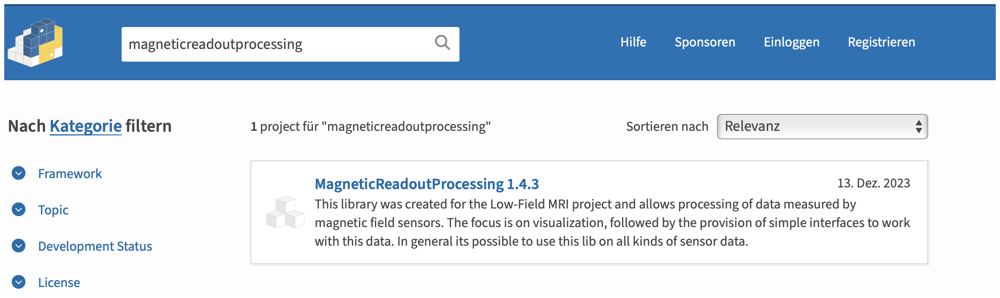


In doing so, (+pip) not only manages possible package dependencies, but also manages the installation of different versions of a package. In addition, the version compatibility is also checked during the installation of a new package, which can be resolved manually by the user in the event of conflicts.

```bash {#lst:setup_lib_with_pip caption="Bash commands to install the MagneticReadoutProcessing (+mrp)-library using pip"}
# https://pypi.org/project/MagneticReadoutProcessing/
# install the latest version
$ pip3 install MagneticReadoutProcessing
# install the specific version 1.4.0
$ pip3 install MagneticReadoutProcessing==1.4.0
```

To make the (+mrp)-library compatible with the package directory, Python provides separate installation routines that build a package in an isolated environment and then provide an installation `wheel` archive. This can then be uploaded to the package directory.

Since the (+mrp)-library requires additional dependencies (e.g. `numpy`, `matplotlib`), which cannot be assumed to be already installed on the target system, these must be installed prior to the actual installation. These can be specified in the (+mrp)-library installation configuration `setup.py`\ref{lst:setup_py_req} for this purpose.

```python {#lst:setup_py_req caption="setup.py with dynamic requirement parsing used given requirements.txt"}
# dynamic requirement loading using 'requirements.txt'
req_path = './requirements.txt'
with pathlib.Path(req_path).open() as requirements_txt:
    install_requires = [str(requirement) for requirement in pkg_resources.parse_requirements(requirements_txt)]

setup(name='MagneticReadoutProcessing',
      version='1.4.3',
      url='https://github.com/LFB-MRI/MagnetCharacterization/',
      packages= ['MRP', 'MRPcli', 'MRPudpp', 'MRPproxy'],
      install_requires=install_requires,
      entry_points={
          'console_scripts': [
            'MRPCli = MRPcli.cli:run',
            'MRPUdpp = MRPudpp.uddp:run',
            'MRPproxy = MRPproxy.mrpproxy:run'
          ]
      }
    )
```

To make the (+cli) scripts written in Python easier for the user to execute without having to use the `python3` prefix. This has been configured in the installation configuration using the `entry_points` option, and the following commands are available to the user:

* `MRPcli --help` instead of `python3 cli.py --help`
* `MRPudpp --help` instead of `python3 udpp.py --help`
* `MRPproxy --help` instead of `python3 proxy.py --help`

In addition, these commands are available globally in the system without the terminal shell being located in the (+mrp)-library folder.


### Documentation


In order to provide comprehensive documentation for the enduser, the source code was documented using Python-`docstrings`[@PythonDocstringReference] and the Python3.5 type annotations:

* Function description
* Input parameters - using `param` and `type`
* Return value - using `returns`, `rtype`

The use of type annotations also simplifies further development, as modern (+ide)s can more reliably display possible methods to the user as an assistance.\ref{pydocstring}

```python {#lst:pydocstring caption="Python docstring example"}
    # MRPDataVisualisation.py - example docstring
    def plot_temperature(_readings: [MRPReading.MRPReading], _title: str = '', _filename: str = None, _unit: str = "degree C") -> str:
        """
        Plots a temperature plot of the reading data as figure
        :param _readings: readings to plot
        :type _readings: list(MRPReading.MRPReading)
        :param _title: Title text of the figure, embedded into the head
        :type _title: str
        :param _filename: export graphic to an given absolute filepath with .png
        :type _filename: str
        :returns: returns the abs filepath of the generated file
        :rtype: str
        """
        if _readings is None or len(_readings) <= 0:
            raise MRPDataVisualizationException("no readings in _reading given")
        num_readings = len(_readings)
        # ...
```


Since 'docstrings' only document the source code, but do not provide simple how-to-use instructions, the documentation framework `Sphinx`[@SphinxDocumentation] was used for this purpose. This framework makes it possible to generate (+html) or (+pdf) documentation from various source code documentation formats, such as the used `docstrings`.
These are converted into a Markdown format in an intermediate step and this also allows to add further user documentation such as examples or installation instructions.

In order to make the documentation created by `Sphinx` accessible to the user, there are, as with the package management by `PyPi` services, which provide Python (+mrp)-library documentation online.

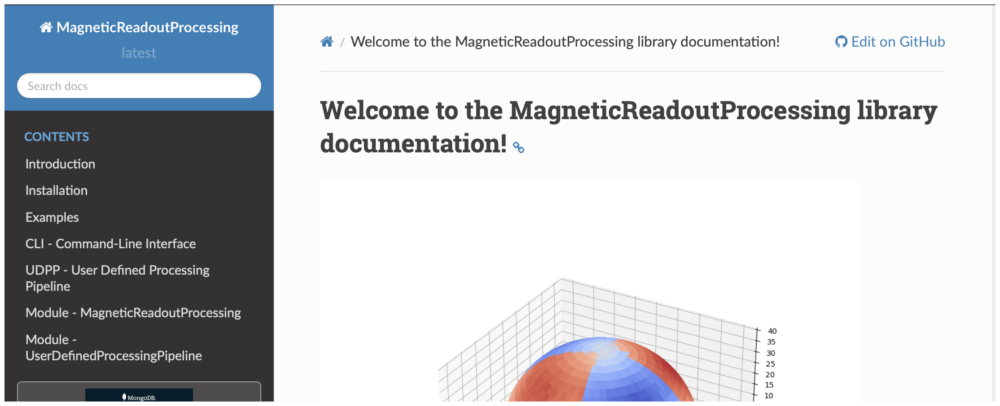


Once the finished documentation has been generated from static (+html) files, it is stored in the project repository. Another publication option is to host the documentation via online services such as `ReadTheDocs`[@ReadTheDocs], where users can make documentation for typical software projects available to others.

The documentation has also been uploaded for `ReadTheDocs`[@MagneticReadoutProcessingReadTheDocs] and linked in the repository and on the overview page\ref{MagneticReadoutProcessing_documentation_hosted_on_ReadTheDocs.png} on `PyPi`.

The process of creating and publishing the documentation has been automated using `GitHub Actions`[@GithubActions], so that it is always automatically kept up to date with new features.


# Evaluation


## Prequesites for evaluation


## Evaluation confiugration

### Sensor readout

### Processing pipeline

## Test scenarios

## Results


# Conclusion and dicussion
## Conclusion

## Problems

## Outlook

* magfield camera


