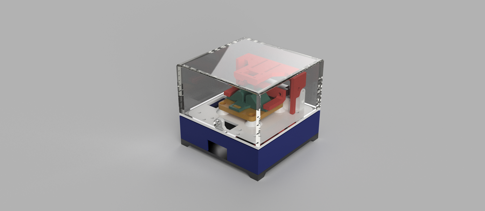

# dual_sensor

## BOM

| amount | part               |
|--------|--------------------|
| 18     | M3x10 SHCS         |
| 18     | HEAT INSERT M3     |
| 3      | M4x10 SHCS         |
| 3      | HEAT INSERT M4     |
| 2      | Adafruit TLV493D   |
| 1      | STM32F407VG-DISC   |
| 1      | Adafruit TCA9548A  |
| 3      | Adafruit STEMMA QT |
